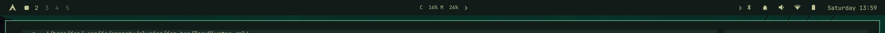
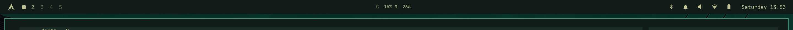
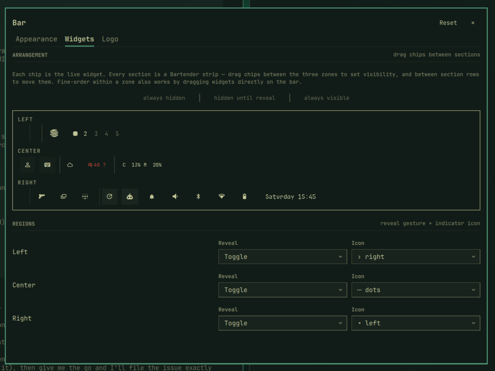
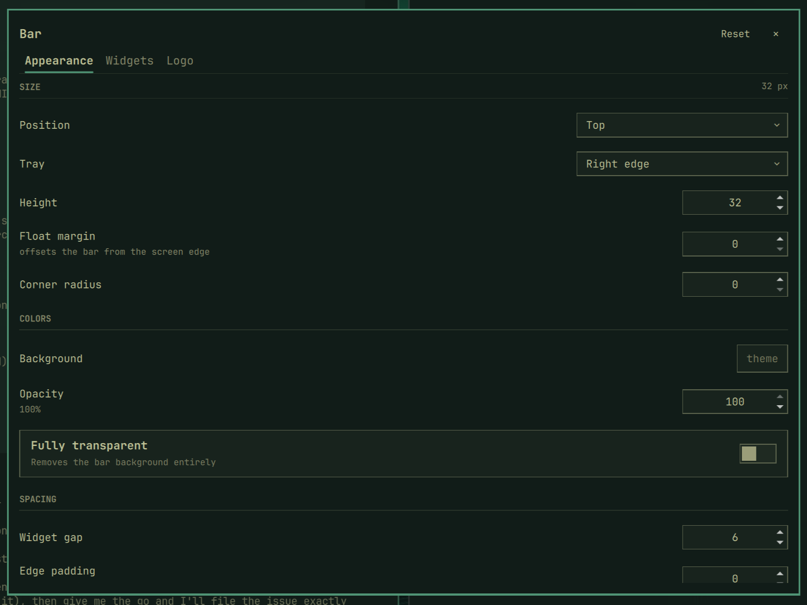
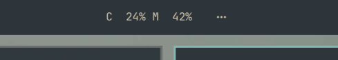
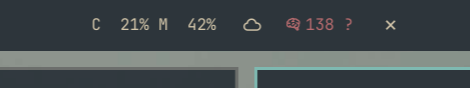
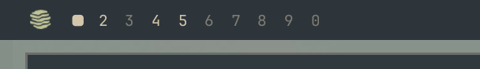
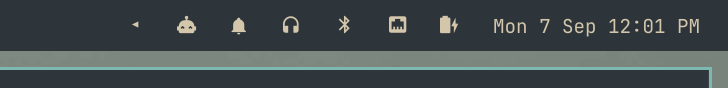
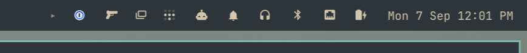

# skål.bar

I love the stripped-down feel of the default Omarchy bar: a thin, quiet strip that stays out of the way. But I kept running into its limits — I wanted to tuck more of it away, tune how it looks and sits on the screen, and interact with it rather than just read it. So I built the bar I wanted on top of it.

That's skal.bar: the same minimal strip, now with Bartender-style hidden widget drawers, Noctalia-style appearance control, a native system tray, a quick action panel on the menu trigger, and a settings GUI so none of it requires editing JSON by hand.

Runs inside `omarchy-shell`. Nothing in `/usr/share` is modified.





Each section is a Bartender strip: widgets hide behind a reveal indicator (`›`, dots, or your own glyph) and slide out on hover or click. Arrange everything visually in the settings GUI:





The same idea at work across the bar — sections tuck away, then reappear the moment you ask:

| Center tucked — `…` marks the drawer | Center revealed — `…` crossfades to `×` |
|---|---|
|  |  |

| Left — logo & workspaces | Indicators & tray |
|---|---|
|  |  |

And the same right end moments later, with more indicators active as toggles land:



## Features

- Hidden widget **drawers per section** — widgets slide out of the tray/chevron, Bartender-style
- Per-region **reveal mode** (hover / toggle) and **indicator icon** (arrows rotate, dots/bars crossfade to ✕)
- Appearance: height, float margin, corner radius, background color/opacity, widget gap, edge padding, position
- **Native tray** with drawer, pinned icons, item menus — chevron doubles as the reveal toggle
- **Custom logo** on the menu widget (glyph, font, size, color, image)
- **Quick action panel** on the menu trigger — left-click opens a 2×2 tile panel (silence notifications, night light, stay awake, dictation); right-click still opens the Omarchy menu
- **Toggle notifications** — every quick action announces its new state on screen, whether flipped from a tile, a hotkey, or the `omarchy` CLI
- **Settings GUI**: SUPER+ALT+B or right-click blank bar space
- Window tops track bar geometry + Hyprland gaps automatically

## Install

Requires [Omarchy](https://omarchy.org).

```bash
omarchy plugin add https://github.com/outcrop-labs/skal-bar.git --enable --yes
omarchy bar use skal.bar
```

Optional keybind in `~/.config/hypr/bindings.lua`:

```lua
o.bind("SUPER + ALT + B", "Bar settings", "omarchy-shell shell toggle skal.bar")
```

Right-click any blank bar space also opens settings. See [Hotkeys](#hotkeys) for the quick action panel and per-tile binds.

## Uninstall

```bash
omarchy bar use omarchy.bar
omarchy plugin remove skal.bar --yes
```

Remove the keybind from `~/.config/hypr/bindings.lua` if added.

## Dependencies

- [zenity](https://gitlab.gnome.org/GNOME/zenity) (optional) — OS file picker for the logo browser: `sudo pacman -S zenity`. Without it, type the SVG path manually.

## Config

All keys live under `bar` in `~/.config/omarchy/shell.json`. Hot-reloads on save.

```json
{
  "bar": {
    "id": "skal.bar",
    "position": "top",
    "height": 32,
    "margin": 6,
    "radius": 14,
    "backgroundColor": "",
    "backgroundOpacity": 0.9,
    "widgetSpacing": 4,
    "edgePadding": 8,
    "traySection": "right",
    "hiddenReveal": "hover",
    "hiddenRevealByRegion": { "center": "click" },
    "revealIcons": { "left": "❯" },
    "layout": {
      "left":   [ { "id": "omarchy.menu" }, { "id": "omarchy.workspaces" } ],
      "center": [ { "id": "omarchy.clock" } ],
      "right":  [ { "id": "omarchy.audio", "hidden": "hover" }, { "id": "omarchy.power" } ]
    }
  }
}
```

### Appearance keys

| Key | Default | What it does |
|---|---|---|
| `position` | `"top"` | `top` / `bottom` / `left` / `right` |
| `height` | `0` | Bar thickness in px (font-scaled). `0` = theme size |
| `margin` | `0` | `>0` floats the bar off the screen edge |
| `radius` | `0` | Corner radius in px |
| `backgroundColor` | `""` | `#rrggbb` override. Empty = theme |
| `backgroundOpacity` | `1` | `0..1` background alpha |
| `transparent` | `false` | Removes the background entirely (also: double-click blank center space) |
| `widgetSpacing` | `0` | Gap in px between widgets |
| `edgePadding` | theme | Padding at the outer ends of left/right sections |
| `centerAnchor` | `"omarchy.clock"` | Pins one center module to the exact center; `""` centers the group |
| `traySection` | `"right"` | `left` / `right` / `none` |

CLI: `omarchy bar set <widget-id> <key> <value>`, e.g. `omarchy bar set omarchy.clock format HH:mm`.

### Widget hidden states

| Value | Behavior |
|---|---|
| `"shown"` | default — always visible |
| `"hover"` | hidden until the region is revealed |
| `"always"` | never shown |

`"hidden": true` = `"hover"`.

### Per-region keys

- `hiddenRevealByRegion.<section>` — `"hover"` or `"click"` (falls back to `hiddenReveal`)
- `revealIcons.<section>` — `› ‹ ❯ ❮ ▸ ◂ ▾ ▴ ⋯ ≡`

### Tray

`traySection` — `left` / `right` / `none`. Pinned/hidden tray items persist under `bar.tray`.

### Logo

Settings for any cloned menu widget entry. `logoMode` picks the source:

| Value | Behavior |
|---|---|
| `"glyph"` | text/icon glyph (`logo`, `logoFont`, `logoSize`, `logoColor`) |
| `"image"` | SVG image (`logoImage`, tinted by `logoColor` when set) |

`logoColor` takes theme tokens (`accent`, `foreground`, `urgent`, `muted`, `background`) resolved live against the active theme, or a literal `#rrggbb`.

```json
{ "id": "your.menu", "logoMode": "image", "logoImage": "~/Pictures/logo.svg", "logoColor": "#C1C497" }
```

The settings panel's Browse button opens the OS file picker (requires `zenity`), filtered to SVG.

### Quick actions

The menu trigger is more than a launcher. Left-click opens a compact quick action panel anchored to the logo:

| Input | Action |
|---|---|
| Left-click | Quick action panel |
| Right-click | The Omarchy menu |
| Middle-click | A terminal |

Four tiles: **Silence Notifications** (DND), **Night Light**, **Stay Awake**, **Dictation**. Active tiles fill with the accent color, and every toggle is reflected live in the bar — flip Night Light and its indicator appears immediately.

Keyboard: arrows move between tiles (sideways steps one, vertical steps a row), `Enter`/`Space` activates, `Esc` closes. See [Hotkeys](#hotkeys) for opening the panel from the keyboard and binding the individual tiles.

The menu trigger ships with the bar — one plugin, one install. Its layout entry carries the logo settings (`{"id": "skal.bar", "logo": "󰣇"}`), so the default Omarchy menu stays untouched; a cloned `*.menu` widget works too if you prefer to keep them separate.

## Hotkeys

Everything the bar exposes is reachable from the keyboard. Binds go in `~/.config/hypr/bindings.lua` and hot-apply on save — see existing keys with `omarchy menu keybindings --print`.

### Quick action panel

```lua
o.bind("SUPER + ALT + Q", "Quick actions", "omarchy-shell -q skal.bar.controls toggle")
```

The `skal.bar.controls` target is owned by the bar itself, so the panel always opens on the monitor that has keyboard focus — with one widget copy per screen, a per-widget target would only ever answer on whichever monitor registered first. `open` and `close` work too, if you want one-way binds.

To take over a key Omarchy already binds, unbind the default first. This replaces the System menu on SUPER+ESCAPE (its entries remain in the Omarchy menu):

```lua
hl.unbind("SUPER + ESCAPE")
o.bind("SUPER + ESCAPE", "Quick actions", "omarchy-shell -q skal.bar.controls toggle")
```

### Settings

```lua
o.bind("SUPER + ALT + B", "Bar settings", "omarchy-shell shell toggle skal.bar")
```

Right-clicking blank bar space opens the same panel.

### Individual actions

Each panel tile has a one-key form. A recommended starting set, mirroring the panel's row:

```lua
o.bind("SUPER + F1", "Silence notifications", "omarchy toggle notification silencing")
o.bind("SUPER + F2", "Night light", "omarchy toggle nightlight")
o.bind("SUPER + F3", "Stay awake", "omarchy toggle idle")
o.bind("SUPER + F4", "Dictation", "omarchy-shell -q skal.bar.controls dictation")
```

Two gotchas worth knowing:

- **Stay awake must use the bare toggle.** `omarchy toggle idle` toggles; `omarchy toggle idle stay-awake` and `... allow-idle` are one-way (always on / always off). A hotkey bound to the `stay-awake` form switches it on and then appears broken — pressing it again does nothing.
- **F-row keys can be media keys.** On keyboards whose F1–F12 default to brightness/volume (many laptops and the Keychron F-row switch), the bind never fires — hold `Fn` or flip Fn-lock.

Any other action can be bound the same way: point `o.bind` at the command behind the tile. The service-backed set: `omarchy toggle notification silencing`, `omarchy toggle nightlight`, and `omarchy toggle idle` (or `stay-awake` / `allow-idle` for explicit on/off). Dictation has no such CLI state, so it routes through the bar (see below).

### Notifications

Every toggle dispatches a desktop notification. The bar watches the underlying services rather than the buttons, so the confirmation is identical whether the change came from a panel tile, a hotkey, or the `omarchy` CLI — and fires for other sources too (the settings GUI, another plugin flipping the same service). Each action reuses a single notification id, so rapid re-toggling replaces the toast instead of stacking them, and the first few seconds after the shell starts stay quiet so load-time state reads don't announce themselves.

Two details:

- **Toasts show through DND.** The dispatches carry the daemon's `omarchy-action` identity, which do-not-disturb deliberately lets through — you just flipped a switch, so the confirmation is never silenced.
- **Dictation routes through the plugin.** voxtype keeps its state inside the daemon with nothing to watch, so its hotkey calls the bar (`omarchy-shell -q skal.bar.controls dictation`), which toggles, reads the daemon status a moment later, and announces "recording" or "stopped". The panel tile takes the same path.

## Troubleshooting

If the menu widget fails to load after updating the plugin in place — the log shows `Plugin widget skal.bar failed` — the compiled QML cache is stale from the reload race. Clear it and restart:

```bash
rm -rf "$HOME/.cache/quickshell/qmlcache" "$HOME/.cache/quickshell"/qtpipelinecache-*
omarchy restart shell
```

### Settings panel shows defaults / controls do nothing

The panel reads live state from the `shell` API object the host injects into it.
On Omarchy 4.0.3 that object can be destroyed by the host's plugin-API pruning
while the panel still holds it (observed at cold start and after any plugin
reload) — the bar itself keeps working because it re-requests a fresh object on
every reload, but an already-loaded panel is never re-injected, so it renders
defaults and every control no-ops. Your `shell.json` is untouched; reopening
the panel is not enough because the same dead instance stays loaded.

That is why this plugin ships `"keepLoaded": false`: the settings panel is
(re)created each time it is summoned, and every creation gets a freshly
injected, current `shell` object — the same recovery path the bar uses. The
trade-off is that panel-internal state (selected tab) resets between opens.
If a future Omarchy release re-injects or stops destroying live shell APIs,
`keepLoaded` can go back to `true`.

## Credits

Derived from the [Omarchy](https://omarchy.org) shell's bar and tray plugins
(MIT, © David Heinemeier Hansson) — thanks to the Omarchy contributors for
the excellent foundation.

## License

MIT © Outcrop Labs. Portions © David Heinemeier Hansson / Omarchy, under MIT.
